# Base Architecture of nib

nib is a **local-first AI agent**. Session data (conversations + tool calls) is stored as JSON files inside the selected profile's `.nib/profiles/<id>/sessions/` directory by default. It breaks down goals, executes work through approval, worktree, and optional `bwrap` layers, and keeps an auditable history per profile.

This document describes the **base architecture** — the core components, data flows, principles, and integration points that every part of nib must respect.

See also:
- [Project Structure](project_structure.md)
- [Backend Rust](backend_rust.md)
- [Permissions](permissions.md) (defense-in-depth model)
- [Ecosystem Integration](ecosystem_integration.md) (MCP, Skills, AGENTS.md)
- [FT-001: Basic Agent Tools](../specs/done/ft_001_basic_agent_tools.md)
- [FT-003: Hybrid Sandboxing](../specs/done/ft_003_adopt_codex_sandboxing.md) (implemented in Rust with reconciled audit evidence)
- [FT-004: LLM Integration and Agent Loop](../specs/done/ft_004_llm_integration_and_agent_loop.md) (reasoning + tool loop)

## High-Level Principles

1. **Session History is Sacred**
   - All conversation messages and tool executions are stored in the selected profile's sessions directory.
   - This gives full per-session auditability without a global database.
   - Every audited tool call records bounded, redacted arguments and results, its
     approval decision, worktree, and boundaries. Raw secret values are deliberately
     not retained.

2. **Defense-in-Depth for Safety**
   - No tool action (especially destructive ones like `run_terminal` or broad patches) can occur without passing multiple independent layers: scoping, isolation (worktrees), classification, policy/AGENTS.md rules, explicit approval (manual or prior grant), redaction, and audit.
   - See the full [Permissions](permissions.md) document.

3. **Leverage, Don't Duplicate**
   - Reuse existing ecosystem primitives: kanban/todo/delegation/cron patterns, subagent patterns, MCP servers (GitHub, Notion, etc.), Skills (SKILL.md), AGENTS.md guidelines.
   - nib's job is **orchestration + safe execution + session history**, not reimplementing a general-purpose agent.

4. **Fresh Context + Verification Loops**
   - Prefer fresh sub-agents, isolated worktrees, and clean context for implementation work.
   - Two-stage review (spec compliance then quality) and post-execution reconciliation are default.
   - The agent (and sub-agents) must load and respect relevant AGENTS.md + active Skills before acting.

5. **Human-in-the-Loop by Default**
   - Status, blockers, decisions, and risks are highly visible (CLI + TUI).
   - Escalation points (clarify, approve, review diff) are first-class.

6. **Context-Rich but Token-Efficient**
   - Assemble AGENTS.md, relevant Skills and references, profile memory, recent session history, and connected MCP tools.
   - Enforce a configured history budget and compress older context into an audited summary while preserving raw messages.

## Core Components

```
User / Workload Owner
        │
        ▼
┌──────────────────────────────┐
│ Unified Interactive Launcher │  (clap; plain / ratatui modes)
└──────────────┬───────────────┘
               │
               ▼
┌───────────────────────────────────────────────┐
│              Context Loader                   │  (AGENTS.md walk-up, Skills discovery/activation,
│  (src/context/)                               │   project standards, libs docs, MCP tool list)
└──────────────┬────────────────────────────────┘
               │
               ▼
┌───────────────────────────────────────────────┐
│              Context + Planner              │
│  (AGENTS.md/skills + LLM reasoning)           │
│  src/context/ + src/agent/loop.rs             │
└──────────────┬────────────────────────────────┘
               │
               ▼
┌───────────────────────────────────────────────┐
│         Tool Executor (the Gatekeeper)        │  (src/tools/executor.rs)
│  • Tool Registry (metadata + PermissionLevel) │
│  • Scoping + Worktree isolation               │
│  • Classification (read-only / safe /         │
│    destructive / network)                     │
│  • Policy + AGENTS.md + Skills constraints    │
│  • Approval workflow (manual/smart/policy/off)│
│  • Redaction                                  │
│  • Dispatch to impls + Audit to SessionStore  │
└──────────────┬────────────────────────────────┘

               │
       ┌───────┴───────┬───────────────┬──────────────┐
       ▼               ▼               ▼              ▼
┌─────────────┐ ┌─────────────┐ ┌─────────────┐ ┌─────────────┐
│ Core Tools  │ │ Integrations│ │ MCP Client  │ │ Sub-agents  │
│ (read_file, │ │ (git,       │ │ / Server    │ │ (subagent   │
│  list_dir,  │ │  subagent,  │ │ (expose     │ │  profiles,  │
│  grep,      │ │  lanes,     │ │  nib tools  │ │  lanes,     │
│  apply_patch,│ │  github...) │ │  to others) │ │  etc.)      │
│  run_terminal)│ └─────────────┘ └─────────────┘ └─────────────┘
└─────────────┘
               │
               ▼
┌───────────────────────────────────────────────┐
│              Reconciliation                   │  (Update plan outcome, emit lifecycle state,
│  (src/agent/loop.rs)                          │   preserve artifacts and audit rationale)
└──────────────┬────────────────────────────────┘
               │
               ▼
┌───────────────────────────────────────────────┐
│           Session Store (file-based)         │  (plain JSON files in the profile state directory)
│  • Conversation history (messages)            │
│  • Tool calls with results and approvals      │
│  • Stored under selected profile state        │
└───────────────────────────────────────────────┘
```

### Library Module Map

- `src/lib.rs` — Public library surface for the runtime modules used by the CLI and tests.
- `src/agent/{mod.rs,loop.rs,planner.rs,state.rs}` — Agent orchestration, plan generation, cancellation/question contracts, streamed execution, and reconciled run state.
- `src/config/mod.rs` — Strict project TOML schema, migration, validation, locking, and atomic updates.
- `src/context/{mod.rs,agents.rs,budget.rs,compression.rs,project_docs.rs,skills.rs}` — Profile-aware prompt assembly, AGENTS.md discovery, aggregate budgeting, transcript compression, fixed-root project documentation, and bounded skill discovery/loading.
- `src/daemons/{mod.rs,cron.rs,curator.rs,state.rs,task.rs,workload.rs}` — Cron parsing, retention, shared locked state, in-process timers, and durable detached task leases/reconciliation.
- `src/fs_security.rs` — Shared file identity, no-symlink directory traversal, and replacement-race checks used by persistence and execution boundaries.
- `src/integrations/mod.rs` — Integration namespace and visibility boundary.
- `src/integrations/gateway.rs` — Normalized console and external-messaging ingress/egress contract.
- `src/integrations/mcp.rs` — Outbound MCP stdio client lifecycle and tool dispatch.
- `src/integrations/mcp_framing.rs` — Shared bounded, newline-delimited JSON framing for MCP client/server stdio.
- `src/integrations/mcp_server.rs` — Inbound MCP server exposing the gated nib runtime.
- `src/integrations/worktree.rs` — Session worktree manager built on sandbox ownership receipts.
- `src/llm/{mod.rs,types.rs,registry.rs,factory.rs,openai.rs,responses.rs,anthropic.rs,gemini.rs,mock.rs}` — Provider-neutral structured requests and private completed-turn streams, retry/response bounds, a central structural adapter-capability registry, explicit Chat Completions and Responses transports, provider construction and diagnostics, concrete APIs, and deterministic test doubles. Registry capabilities describe implemented transports, not live model compatibility.
- `src/profile/{mod.rs,migration.rs}` — Workspace profile resolution, isolated state roots, environment loading, and legacy state migration.
- `src/sandbox/mod.rs` — Command-shell resolution, capability checks, direct execution, and optional Linux `bwrap` isolation.
- `src/sandbox/process.rs` — Durable managed-process scopes and Linux PID-namespace, macOS process-group, and Windows Job Object supervision.
- `src/sandbox/windows_job.rs` — Windows Job Object containment backend.
- `src/sandbox/worktree.rs` — Linked-subagent worktree creation, ownership receipts, cleanup, and merge safety.
- `src/session/{mod.rs,memory.rs}` — Indexed role-safe sessions, plans, additive exact-run steering and lifecycle events, tool audit, profile-scoped persistence, and bounded profile memory.
- `src/tools/{mod.rs,classifier.rs,models.rs,registry.rs,executor.rs,core.rs,delegation.rs}` — Tool contracts and metadata, classification, the central approval/policy/sandbox gate, built-in tools, and linked-subagent lifecycle.
- `src/tui/mod.rs` — Current-session-first Ratatui renderer, terminal preflight and
  restoration boundary, overlays, completion, and streamed execution UI.

### Binary Module Map

- `src/main.rs` — Clap command model, no-subcommand interactive dispatch, compatibility
  aliases, runtime setup, and hidden worker/relay entry points.
- `src/auth.rs`, `src/chat.rs`, and `src/run.rs` — Provider authentication, the unified
  interactive launcher with its plain renderer, and unchanged one-shot execution.
- `src/console.rs` — Shared blocking/async console input used by the plain renderer's single-owner active-run broker and other CLI flows.
- `src/config_cmd.rs`, `src/context_cmd.rs`, and `src/doctor.rs` — Configuration management, rendered context inspection, and runtime health checks.
- `src/mcp_cmd.rs`, `src/skill_cmd.rs`, and `src/task_cmd.rs` — MCP server configuration, skill inventory/install/remove operations, and durable task management. Interactive `/ps` and `/stop` use a separate safe projection and atomic active-session ownership check over the same durable store; they never route through its global administrative view.
- `src/version.rs` and `src/updater.rs` — Embedded build identity, strict rolling-release
  manifest checks, verified self-update, and bounded user-facing update notices.
- `src/mcp_test_fixture.rs` — Debug-build-only subprocess fixture for MCP framing, lifecycle, and process-tree tests.

## Data Flow for a Typical Session

1. **Intake / Activation**
   - User creates or resumes a session in the selected profile store.
   - The interactive launcher resolves plain or TUI presentation before authentication,
     session creation, or workload execution. Native input then enters through the
     selected renderer; external messaging adapters authenticate and receive provider
     traffic before passing a payload to the normalized gateway.
   - Context + prompt builder assembles AGENTS.md, project documentation, skills,
     profile memory, workload state, recent history, and tool schemas within one
     aggregate model-context budget.

2. **LLM Reasoning (new in FT-004)**
   - AgentLoop checks the exact-run steering receiver at safe boundaries and builds a
     bounded request containing every durably accepted instruction.
   - AgentLoop sends the prompt to `LLMClient`; only `crate::llm` can consume the raw
     provider stream, and application callers can only finish it. Provider deltas
     remain private until terminal validation succeeds; failed, refused, or incomplete
     streams publish no partial model content or tool proposal.
   - After validation, AgentLoop derives bounded, redacted public content/tool events
     only from the authoritative completed response. Tool lifecycle, approval,
     question, compression, and reconciliation events can remain live independently.
   - Steering that arrived during the response discards its uncommitted content/tool
     proposal and causes a fresh bounded request. Already-started tools finish normally;
     steering is applied before the following provider request.

3. **Execution (gated)**
   - Tool calls go to ToolExecutor:
     - Scope + worktree resolution.
     - Classification + policy/AGENTS enforcement.
     - Approval gate.
     - Hybrid sandbox dispatch (bwrap + boundaries).
     - Full ToolCallRecord written to the session file.
   - Observation appended to session and fed back to LLM.

4. **Loop + Reconciliation**
   - Continue until final answer, approved plan, or limit.
   - Reconciliation advances or blocks the persisted plan and records the final outcome.

5. **Visibility**
   - The selected plain or TUI renderer shows live session history, tool calls (with
     boundaries/approvals), and loop state.

### Working instructions and resource use

`src/agent/instructions.rs` owns the compact shared behavior contract and the
planner/executor-specific instructions. The bounded prompt builders preserve this
contract intact and reject windows too small to hold it. It asks nib to use available
evidence, clarify consequential unknowns, make low-risk assumptions explicit, keep
plans proportional, avoid repeated work, and ground implementation in verification.
These are model instructions; tool permissions, exact plan binding, and reconciliation
are enforced by Rust independently of model compliance.

Normal planning takes one model request and exposes only `submit_plan`, so a needed
inspection or clarification becomes an approved plan step. The disabled-by-default
`agent.answer_only` route may precede planning for a new interactive execute request
when the project and caller do not require planning and no plan or run is active. Its
single bounded request exposes only the typed, non-executable `request_plan` control.
Plain content completes that activity without creating or advancing a plan; a valid
control or unsupported result falls back once to normal planning. Invalid controls
and provider failures terminate the route without also invoking the planner. Active
plan state is left intact and receives no model or tool call from the new request.
Execution can call `ask_question` alone, wait for the answer, and resume; skipped or
unavailable input remains unresolved. Each tool batch continues the current step.
A response without tools requests completion, but an unresolved tool failure keeps
the step blocked. Three consecutive unchanged, fully failed batches stop with an
audited failure instead of consuming the full turn allowance. Changed attempts or
results and successful intervening work permit recovery.

Required verification is persisted separately from coarse step status. Each obligation
is bound to its plan and step, authority (`human`, `project`, or approved plan), exact
tool and normalized arguments, expected result type, audited invocation, managed
worktree, affected-content digest, and immutable attempt history. The executor rejects
a mismatched tool call before side effects. Passing evidence becomes stale when later
audited mutation or completion-time content revalidation finds changed content. Typed
absence evidence is accepted only from an untruncated empty `grep` result. Project
requirements such as `task verify` are derived independently from resolved
instructions; exact human commands are derived from backticks or `$ ` command lines.
A human may waive an unrun non-project obligation with
`waive verification <id>: <reason>`; failed, running, passed, and project obligations
cannot be relabeled as waived. `/status` and plan detail expose each requirement's
state and authority. History reservation follows authoritative message provenance, so
a runtime continuation or tool-origin `user` role cannot displace a later human
correction.

At startup nib resolves bounded global and project-root instruction files, selected
skill bodies/references, fixed-root project documentation, profile memory, workload
state, and attached files. Before each tool batch it resolves every declared target
scope, applies root-to-target and base/local precedence, and refreshes changed file
identities. An opaque mutating terminal command must declare affected paths; a
classified safe command may use its working-directory scope. Incomplete, linked,
oversized, unreadable, or prompt-incompatible required instructions block dependent
execution. Ordinary files, tool observations, remembered facts, and summaries supply
evidence; they do not grant permission or replace the current user request.

An explicit active-skill list on the profile selects by name and reports missing,
ambiguous, or over-budget selections. Otherwise bounded automatic selection uses
stable name, tag, and meaningful two-token description matches, ranks ties
deterministically, and loads at most three skills. Only selected skills can contribute
text, policy, references, or after-tool hooks; selection itself uses no model request.

Fresh requests allocate an initial 45% of the configured window to context sections,
30% to tools, and 25% to history, then shrink within an aggregate serialized-input
bound. Counts use a four-characters-per-token estimate, not provider tokenization.
Attachments participate in this bound and use bounded identity-checked reads. History
reserves space for the latest unsummarized user message before large tool output.
Compression starts at the lower of its configured threshold and the history
allocation, requests a bounded continuation summary, and retains the raw audit trail.
The summary prioritizes intent, constraints, decisions, unanswered questions, failed
approaches, verification evidence, and remaining work. Active provider continuations
retain their separate bounded transport state and defer automatic compression.
Each agent run also persists bounded `agent_resource_usage` evidence: logical
generation requests, executable tool attempts, estimated input-token totals and
maximum, compression requests, and repeated questions. The estimate uses the same
provider-neutral approximation as prompt budgeting and is labeled approximate; raw
prompt or question text is not copied into this accounting event.

The added provenance, clarification, resource, and verification fields use serde
defaults, so current nib reads pre-T041 sessions without inventing human authority or
passing checks. A legacy plan with no obligations receives currently derivable human
and project requirements before execution. A legacy obligation without an exact
invocation contract remains untrusted and makes the plan non-resumable. Older nib
binaries ignore the new object fields when reading, but would drop them if they write
the session. Safe rollback therefore means stopping nib, backing up the profile
session directory, and using the older binary read-only or starting a new session;
do not resume and save a T041 session with an older binary. Restoring the backup and
returning to the T041-or-newer binary preserves the evidence.

Self-development uses the same flow as other implementation work: inspect nib's
instructions/specs and source, edit within the managed worktree, run focused checks
and required Task gates, review the diff, and report artifacts and outstanding work.
Editing source does not alter the running executable; review/merge and installation
remain separate actions. Offline fixtures verify requests, tool execution, and
reconciliation; they do not establish autonomous success for every live model.
Build identity watches Git-resolved HEAD and ref paths, including linked-worktree
and packed-ref layouts, so repeated Task gates do not recompile merely because
`.git` is a file. A previously built source archive converted to a Git checkout needs
a clean build to establish the new identity dependency.

### Sequence Diagram of Interactions

```mermaid
sequenceDiagram
    participant U as User
    participant C as Interactive CLI
    participant L as Agent Loop
    participant Cx as Context Engine
    participant M as MCP Manager
    participant LLM as LLM Provider
    participant T as Tool Executor
    participant S as Session Store

    U->>C: Provides goal or chat input
    C->>L: Start Agent Run (goal, session_id)
    
    rect rgb(30, 40, 50)
        Note over L,S: Turn Initialization
        L->>S: Load or create Session
        L->>M: Initialize MCP Client (Load external tools)
        L->>T: Register Core + MCP Tools
    end
    
    loop Until Goal Met or Max Steps
        L->>Cx: Assemble Context (AGENTS.md, Skills, History)
        Cx-->>L: System Prompt + Injected Skills
        
        L->>LLM: Send Messages + Tools Schema
        LLM-->>L: Response (Text + Tool Calls)
        
        L->>S: Append Assistant Response
        
        alt Has Tool Calls
            loop For each Tool Call
                L->>T: Execute Tool
                T->>T: Verify Permissions & Classify
                T->>T: Check Approval / Sandbox Policy
                T-->>L: Tool Result / Observation
                L->>S: Append Tool Observation
            end
        else No Tool Calls
            L->>L: Mark as Done
        end
    end
    
    L-->>C: Return Agent Run Summary
    C-->>U: Display Results / Prompt for Input
```



## Persistence

- File-based sessions stored locally under `.nib/profiles/<id>/sessions/` by default.
- Each session is a JSON file containing conversation messages, structured `PlanStep`
  state, lifecycle events, and tool call records with approvals and worktree metadata.
- Profile daemon state stores durable background and scheduled task records, including
  leases, cancellation requests, and reconciliation outcomes.
- There is no SQLite or central global Projects/Tasks/Epics backlog database. Older
  T002 proposal text describing one is superseded by the profile-scoped session and
  durable-task model.
- Future: export/import, git-friendly snapshots, or optional bridges to Notion/GitHub Projects.

## Integration Points (Ecosystem)

- **AGENTS.md / CLAUDE.md**: Automatically discovered and injected. Rules can influence classification, require extra approvals, or define safe-mode allowlists.
- **Skills (SKILL.md)**: Discovered from standard locations in the ecosystem (e.g. `~/.config/nib/skills` and project-local `.nib/skills`). Configured via `nib skill` or `/skills`. Provide instructions, constraints, wrappers, or post-hooks. nib itself can be published as a skill.
- **MCP**: The v1 stdio client consumes configured external tools. The v1 stdio server
  exposes agent-run/status and gated executor tools so callers cannot bypass nib's
  permission model. HTTP/SSE transport and OAuth are future work.
- **External messaging**: Telegram, Slack, and Discord adapters own provider
  authentication, listeners, and reply delivery. nib accepts normalized gateway
  payloads and does not let callers inject tool schemas.
- **Sub-agents / Lanes**: Delegation targets with fresh context + worktree. nib owns the lifecycle and reconciliation.
- **Git**: Worktree isolation for changes; status/diff helpers.
- **Project and libs documentation**: `src/context/project_docs.rs` loads text/Markdown
  from fixed project-local `docs/standards`, `docs/tech`, `docs/libs`, and library
  README/docs roots. Discovery never follows symlinks, is deterministic, and is capped
  by depth, scanned entries, file count, per-file bytes, and aggregate bytes before the
  shared model-context budget is applied.

## Technology & Quality

(See [Backend Rust](backend_rust.md) for full details.)
- Rust (edition 2021) is the exclusive runtime.
- `tokio` for async execution.
- `clap` for the CLI and `ratatui` for the TUI.
- `reqwest` and `rustls` for LLM and network interactions.
- `serde` for all JSON and TOML parsing.
- All repeatable work via Taskfile.

## Current Runtime Extensions

- Provider adapters consume response bodies incrementally, but provider model text and
  tool proposals cross the public renderer boundary only after terminal validation of
  the completed response. Failed/refused partial deltas are discarded. Tool lifecycle,
  approval, question, compression, and reconciliation events remain live in the TUI.
  Explicit `/compact` is an exact-session leased, non-steerable maintenance run that
  bypasses only the automatic compression threshold, preserves raw history, and emits
  the same typed compression evidence without synthesizing chat messages.
- Structured plans are persisted, printed, auto-approved for execution, and advanced from verified tool outcomes. The user is asked only when a request is unclear or an action requires approval.
- Compression preserves raw transcripts while bounding model context; profile memory persists environment and user facts.
- The `manage_memory` tool provides bounded list/get/set/delete operations. Reads are
  read-only, writes require approval or an explicit allow policy, deletes are
  destructive, and every call follows the normal session audit path.
- `nib task list|get|cancel|reconcile` exposes durable background state without
  replaying commands whose side effects are uncertain.
- Linked subagents use dedicated worktrees and verification-gated merge. Repository-wide
  merge and recovery serialize on a persistent `.nib` hardlink anchor outside the
  replaceable subagent-records directory.
- Outbound and inbound MCP calls retain nib's approval and audit path.

This architecture keeps nib as a trustworthy, local-first orchestrator that drives LLMs through gated tools while maintaining complete profile-scoped session history.

Update this document whenever core components, flows, or principles change.
